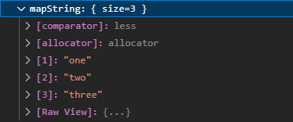
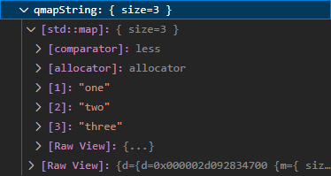
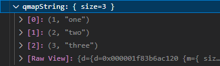

# Qt6 Natvis

This repository is a test suite for my changes to the official Qt6 natvis file that can be found here: [qt6.natvis](https://code.qt.io/cgit/qt-labs/vstools.git/plain/QtMSBuild/QtMsBuild/qt6.natvis.xml).

Note that I removed the `##NAMESPACE##::` from the type name, as this file is parsed and updated by the [Qt Visual Studio Tools](https://marketplace.visualstudio.com/items?itemName=TheQtCompany.QtVisualStudioTools2022).

# Changes

## QMap

| `std::map` |
| :-: |
|  |

| `QMap` before | `QMap` after |
| :-: | :-: |
|  | 
